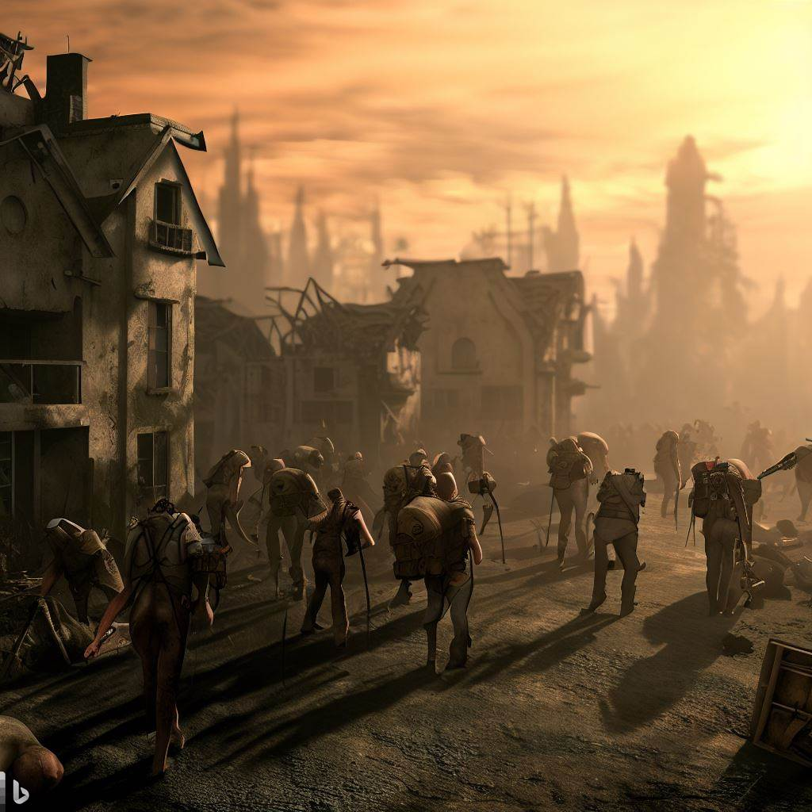

# Remains Of Arda

[![LinkedIn][linkedin-shield]][linkedin-url]

  

  <h3 align="center">Remains Of Arda</h3>

<!-- ABOUT THE PROJECT -->
## About The Project

Remains Of Arda is developed with C# on Unity. It is a multiplayer, fps, tps, strategy and mystery game.
 
The game is about a group trying to survive after the apocalypse. While the traitors in the group try to kill the others, the group members try to identify the traitors and execute them. Each player has a role, 2 abilities that can be used and their own passive abilities. In order to use the ability, he must do a job and earn money. We can say that the role system resembles Town of Salem, the job system resembles Among Us, and the skill system resembles League Of Legends.

This game, which I spent about 4 months of effort, has many features. You can view the codes of the game <a href="https://github.com/Malii61/RemainsOfArda/tree/main/Assets/Scripts">here</a>. The backend part has been completed, but it is not ready visually because there is no 3D Artist.
 
So let's move on to some of the game's features:
* Normal and voice chat experience with Photon Engine.
* Ability to play with FPS and TPS camera angles during the day.
* Writing a diary to record events. Being able to read the diaries of deceased players by purchasing the morning newspaper. Also to be able to learn some player statistics from the last night with the newspaper.
* Using Animation Rigging, Animation Events and Animator Override Controller to ensure that animations work correctly.
* Earning gold with many different jobs. Repairing the bridge, mowing the lawn, mining and even praying are some of these jobs.
* Trying to execute the traitor by voting during the day.
* Quests are coming to everyone in random places. This makes it difficult for players to control each other. In order to show the locations of the tasks, the player is directed with the help of the signs in the settlement.
* Dead players go into spectator mode and can be resurrected later with the help of certain roles.
* With the localization feature, the game can be played in any language.
* With creative roles, players can have a high level of enjoyment. To see the current roles check <a href="https://github.com/Malii61/RemainsOfArda/blob/main/Assets/Scripts/Role/AllRoles.cs">here.</a>
* With the customization feature, the player can adjust his skin as he wishes.
* Many role-specific UI screens and special items
* Easy item control with the inventory system
* All key assignments are prepared using Unity's new input system. The player can change the assigned keys if he wants

  
### Images From Game
  
  
  
  
  
  

 ### Gameplay

https://github.com/Malii61/RemainsOfArda/assets/92629282/8058224a-d03f-4852-99c5-869571c82c4b

 
  
### Installation
 <a>
    If you want to try the game, you can download it from <a href="https://github.com/Malii61/RemainsOfArda/blob/main/Build"> this </a> link. After download open the RemainsOfArda.exe file to run the game.

   
   
Project Link: [https://github.com/Malii61/RemainsOfArda](https://github.com/Malii61/RemainsOfArda)

[linkedin-shield]: https://img.shields.io/badge/-LinkedIn-black.svg?style=for-the-badge&logo=linkedin&colorB=555
[linkedin-url]: https://www.linkedin.com/in/muhammed-ali-tural/
 

****
